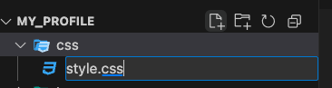

# Hướng dẫn lập trình website cơ bản

## Phần I: "Khởi động"
#### Bước 1. Tạo thư mục lưu trữ code
- Tạo thư mục với tên: `my_profile` (Nên tạo ở Desktop)

#### Bước 2. Mở thư mục bằng Visual Studio Code

## Phần II: "Tạo bộ khung cho website" - HTML
#### Bước 1. Tạo file `index.html`
- Chọn nút `New file`


- Đặt tên file là `index.html` -> Bấm `Enter`


#### Bước 2: Vọc vạch về HTML
- Nhập `ht` -> chọn `html5`


- Nhập `Hello World` vào `body`


=> Code sẽ trông như thế này!!!
```html
<!DOCTYPE html>
<html lang="en">
<head>
    <meta charset="UTF-8">
    <meta name="viewport" content="width=device-width, initial-scale=1.0">
    <title>Document</title>
</head>
<body>
  Hello World!
</body>
</html>
```

- Lưu thay đổi

- Mở website


### Bước 3: Triển khai code html cho website profile
```html
<!DOCTYPE html>
<html lang="en">
<head>
    <meta charset="UTF-8">
    <meta name="viewport" content="width=device-width, initial-scale=1.0">
    <title>Document</title>
</head>
<body>
    <header>Header</header>
    
    <main>
        <h1>Information</h1>
        <ul>
            <li>Name: ChuanVo</li>
            <li>Email: chuanthinhvo@gmail.com</li>
            <li>Phone: 0909 xxy yzz</li>
        </ul>
        <h1>School</h1>
        <ul>
            <li>School: Aptech Viet Nam</li>
            <li>Address: 35/6 D5, Bih Thanh, Ho Chi Minh city</li>
        </ul>
    </main>
</body>
</html>
```

=> Kết quả:


## Phần III: "Làm đẹp cho đời" -  CSS
#### Bước 1: Tạo folder css tại thư mục `my_profile`
- Chọn nút `New folder`


- Đặt tên folder là `css` -> Bấm `Enter`


#### Bước 2: Tạo file `style.css` trong thư mục `css vừa tạo



#### Bước 3: Style cho ảnh profile
- Thêm đoạn code sau vào file `style.css` vừa tạo
```css
img {
    width: 200px;
    height: 200px;
    border-radius: 50%;
    position: absolute;;
    margin-top: -100px;
    margin-left: 20px;
}
```

Kiểm tra website có thay đổi gì không?

#### Bước 4: Thêm đường dẫn file `style.css` và file `index.html`
- Thêm đoạn code sau vào trong cặp thẻ `<head> </head>` trong file `index.htlml`
```html
    <link rel="stylesheet" href="./css/style.css">
```

Kết quả:


#### Bước 5: Style cho Header của trang web
- Thêm đoạn code sau vào file `style.css`
```css
header {
    background-image: url(../img/bg_school.png);;
    height: 30vh;;
}
```

#### Bước 6: Style cho thông tin cá nhân
- Thêm đoạn code sau vào file `style.css`
```css
body {
    margin: 0; 
    padding: 0;
}

main {
    margin-left: 240px;;
}

h1 {
    color: #cc3366;
}
```

#### Nội dung hoàn chỉnh của file `index.html` và file `style.css`
- `index.html`
```html
<!DOCTYPE html>
<html lang="en">
<head>
    <meta charset="UTF-8">
    <meta name="viewport" content="width=device-width, initial-scale=1.0">
    <title>Document</title>
    <link rel="stylesheet" href="./css/style.css">
</head>
<body>
    <header>Header</header>
    
    <main>
        <h1>Information</h1>
        <ul>
            <li>Name: ChuanVo</li>
            <li>Email: chuanthinhvo@gmail.com</li>
            <li>Phone: 0909 xxy yzz</li>
        </ul>
        <h1>School</h1>
        <ul>
            <li>School: Aptech Viet Nam</li>
            <li>Address: 35/6 D5, Bih Thanh, Ho Chi Minh city</li>
        </ul>
    </main>
</body>
</html>
```

- `style.css`
```css
img {
    width: 200px;
    height: 200px;
    border-radius: 50%;
    position: absolute;;
    margin-top: -100px;
    margin-left: 20px;
}

header {
    background-image: url(../img/bg_school.png);;
    height: 30vh;;
}

body {
    margin: 0; 
    padding: 0;
}

main {
    margin-left: 240px;;
}

h1 {
    color: #cc3366;
}
```

=> Kết quả: 


## Phần IV: Bài tập
- **Bài 1:** Thay đổi màu chữ tiêu đề từ đỏ -> xanh


Gợi ý: Sử dụng thuộc tính `color: blue;`

- **Bài 2:** Thêm hiệu ứng animation để tiêu đề đổi từ xanh -> đỏ và ngược lại

Gợi ý:
```css
h1 {
    color: #cc3366;
    animation-name: changeColor;
    animation-duration: 4s;
}

@keyframes changeColor {
    from {color: #cc3366;}
    to {color: blue;}
}
```